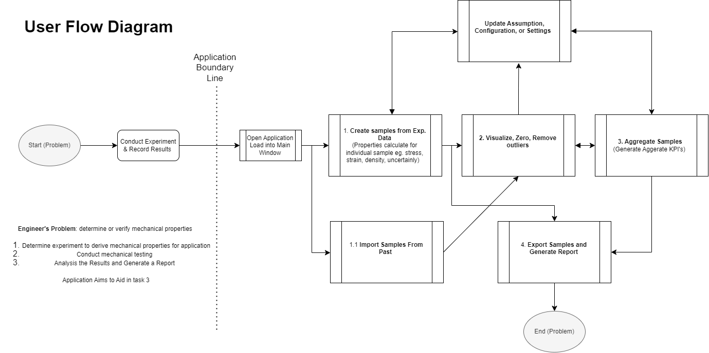

# UX Design Plan for Stress Strain Analysis App

## Introduction
The **Stress Strain Analysis App** is a desktop tool designed to help engineers and researchers derive mechanical properties of materials from test data. This document outlines the user experience, covering the app’s flow, primary pages, and specific UX considerations. For details on style, color, and typography, refer to the [Style Guide](./Style.md).

### Purpose
This app supports:
1. **Test Setup and Configuration**: Start test procedures and set assumptions.
2. **Data Management**: Import and prepare sample data for analysis.
3. **Visualization and Reporting**: Generate visualizations and compile reports for traceability.

### Target Audience
The primary users are engineers and researchers who require precise, traceable data handling and documentation for material testing.

---

## User Flow

The user flow guides users through a sequential process, from configuring tests to generating reports. This structure is designed for ease of use, ensuring that each page follows logically from the previous one. The flow is as follows:

1. **Test Setup** – Configure initial parameters.
2. **Sample Creation** – Import and manage sample data.
3. **Data Cleaning & Grouping** – Clean, group, and process data.
4. **Visualization & Customization** – Create and adjust data visualizations.
5. **Report Generation** – Export data and visuals in structured reports.

### User Flow Diagram

This diagram provides a visual summary of the steps users take within the app. For further detail on specific features, see [App Features](./App_Features.md).

---

## Key Pages and Wireframes

### 1. Test Setup
- **Purpose**: Configure test parameters and set assumptions.
- **Features**: Select test type, configure machine settings, and review test assumptions. 
- **Wireframe**:
  

### 2. Sample Creation
- **Purpose**: Import and configure sample data for analysis.
- **Features**: Load data files, configure measurements, and select standards.
- **Wireframe**:
  

### 3. Data Cleaning & Grouping
- **Purpose**: Prepare and group sample data for accurate analysis.
- **Features**: Clean data by removing outliers, zero values, and creating sample groups.
- **Wireframe**:
  

### 4. Visualization & Customization
- **Purpose**: Generate and customize visual representations of data.
- **Features**: Create plots, adjust titles and axes, save and export visualizations.
- **Wireframe**:
  

### 5. Report Generation
- **Purpose**: Compile findings and export comprehensive reports.
- **Features**: Configure report contents, select visuals, and export as MS Word and Excel.
- **Wireframe**:
  

---

## Interaction Design

### Icon and Text Pairing
Each button includes a paired icon and label, such as:
- 🧪 **Setup**
- 🔬 **Samples**
- 🧹 **Data Prep**

### Button States and Feedback
Buttons display hover and pressed states for interactivity, providing users with visual feedback. For design details, see [Style Guide](./Style.md).

### Error Handling
Clear, descriptive error messages are provided across the app, especially in forms and data-entry sections. This helps users understand and resolve issues promptly.

---

## Accessibility

To ensure accessibility, this app includes the following features:
1. **High Contrast Colors**: A contrast ratio of at least 4.5:1 is used across the interface. (See [Style Guide](./Style.md) for color specifications.)
2. **Keyboard Accessibility**: The app is fully navigable using a keyboard.
3. **Text Readability**: Line length is limited to 80 characters for readability.
4. **Color-Independent Cues**: Interactive elements and error messages use text and icons, rather than relying solely on color.

---

## Conclusion
This UX Design Plan provides a high-level view of the app’s user flow and primary pages. It is intended to be a live document, updated as the app evolves. For a deeper dive into specific features, see [App Features](./App_Features.md).
