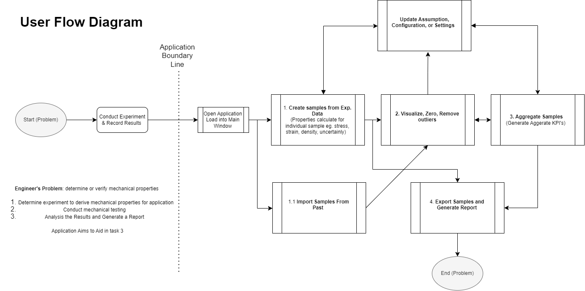
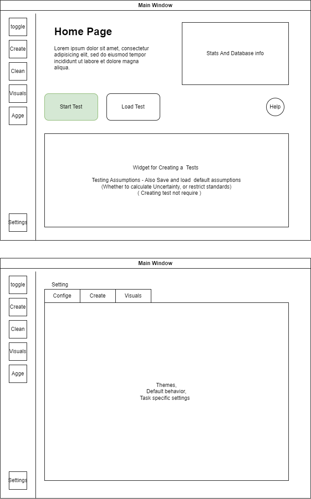

# UX Design Plan for [Stress Strain Analysis App]

## Introduction
Briefly introduce the purpose of this document and what the application aims to achieve. Describe the target audience and the main user needs that the application will address.

## User Flow
Discuss the overall user flow of the application. This should outline the path users will take from entering the application to completing their goals.

'
App Purpose: Derive the mechanical properties of a material

start main window
1. Specify the test procedure (Tensile, Compression, machine info, etc), the samples and the analysis standard.   
2. Visualization samples to Zero, remove anomalies or compare to other materials / SPECs
3. Generate Aggerates Reports of selected samples
4. Store data for trackability and repeatability 
'

### Initial User Flow Diagram

*Description of the user flow diagram, explaining the main steps.*

## Wireframing
Detail the wireframing process, which helps in visualizing the skeletal framework of the application.

### Key Screens
Here you can describe and show wireframes of key screens in your application.

#### Home Screen

*Description of the home screen wireframe.*

#### User Profile Screen

*Description of the user profile screen wireframe.*

### Interaction Design
Discuss any notable interactions or animations that will enhance the user experience.

## Theme / Style Selection
Describe the visual theme or style guide for the application. This could include colors, typography, iconography, and overall aesthetic.

### Mood Board

*Explanation of the mood board choices and how they relate to the application's theme.*

### Color Palette

*Details about the chosen colors and their significance in the user interface.*

## Tips / Notes to self
- Create a hierachy with fonnt & Button size, wieght and colour by action on which to click